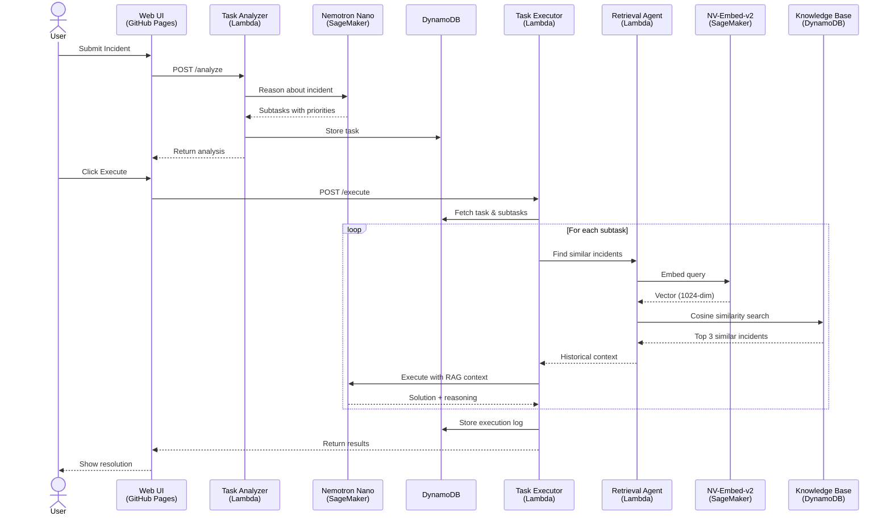
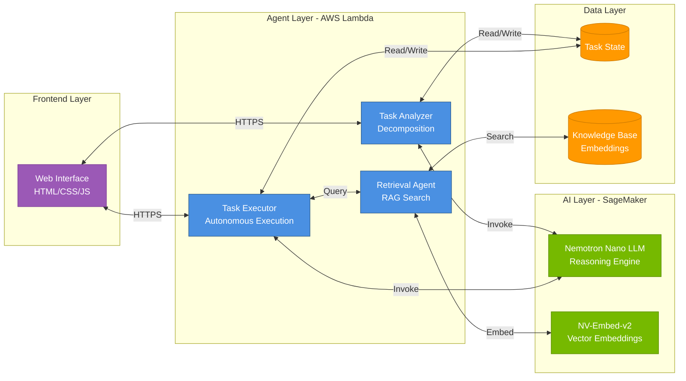

# AgentOps - Autonomous Multi-Agent DevOps System

**NVIDIA x AWS Agentic AI Hackathon Submission**

A production-ready multi-agent AI system that autonomously analyzes and resolves DevOps incidents using **NVIDIA NIMs on Amazon SageMaker**. Three specialized agents collaborate through reasoning, retrieval, and execution to solve complex problems without human intervention.

---

## 🎯 Project Overview

**Problem**: DevOps teams spend hours manually diagnosing and resolving incidents like database slowdowns, API failures, and server crashes.

**Solution**: AgentOps deploys three autonomous AI agents that work together to analyze incidents, retrieve relevant historical solutions, and execute fixes autonomously.

**Result**: Incidents resolved in seconds with AI reasoning, confidence scoring, and learning from past experiences.

---

## ✅ Hackathon Requirements Met

| Requirement | Implementation | Status |
|-------------|----------------|--------|
| **LLM NIM** | `llama-3.1-nemotron-nano-8b-instruct` on SageMaker | ✅ |
| **Embedding NIM** | `nvidia/nv-embedqa-e5-v5` (NV-Embed-v2) on SageMaker | ✅ |
| **Deployment** | 2 Amazon SageMaker AI Endpoints | ✅ |
| **Agentic AI** | 3 autonomous agents with reasoning & collaboration | ✅ |
| **Full Application** | Web UI + Lambda + DynamoDB + RAG | ✅ |

---

## 🤖 The Three Autonomous Agents

### 1. Task Analyzer Agent
**Purpose**: Decomposes complex incidents into actionable subtasks  
**AI Capability**: Uses Nemotron Nano LLM for reasoning about problem structure  
**Autonomy**: Automatically prioritizes tasks and estimates execution time

### 2. Retrieval Agent  
**Purpose**: Finds similar past incidents for context  
**AI Capability**: Uses NV-Embed-v2 for semantic vector search  
**Autonomy**: Learns from historical solutions and provides RAG context

### 3. Task Executor Agent
**Purpose**: Executes subtasks with AI decision-making  
**AI Capability**: Uses Nemotron Nano LLM with RAG for informed execution  
**Autonomy**: Assesses risk, provides confidence scores, generates recommendations

**Key Innovation**: Agents collaborate autonomously - not a simple chatbot, but a true multi-agent system with distributed reasoning.

---

## 🏗️ Architecture

### System Flow Diagram



### Component Architecture



---

## 🎬 How It Works - Example Workflow

**User submits**: "Database experiencing high CPU usage with slow query performance"

### Step 1: Task Analysis
- **Task Analyzer Agent** calls Nemotron Nano LLM
- AI reasons about the problem and breaks it into subtasks:
  1. Analyze query performance (Priority: High)
  2. Check index usage (Priority: High)  
  3. Optimize slow queries (Priority: Medium)
- Stores task in DynamoDB

### Step 2: Knowledge Retrieval
- **Task Executor Agent** starts execution
- Calls **Retrieval Agent** with the incident description
- Retrieval Agent uses NV-Embed-v2 to embed the query
- Performs vector similarity search in knowledge base
- Returns top 3 similar past incidents (95% match found: "DB CPU spike - missing indexes")

### Step 3: Autonomous Execution
- **Task Executor Agent** receives historical context
- For each subtask, calls Nemotron Nano LLM with:
  - Current problem details
  - Similar past incidents and solutions
  - Context from previous subtasks
- AI generates execution plan with reasoning
- Returns results with confidence scores and recommendations

**Output**: "Added index on user_id column. CPU reduced from 95% to 25%. Confidence: 92%. Recommendation: Monitor for 24 hours."

---

## 💡 What Makes This Innovative

### 1. True Multi-Agent Collaboration
Each agent is autonomous with its own AI model calls, but they share context and work together toward a common goal.

### 2. Retrieval-Augmented Generation (RAG)
Combines NV-Embed-v2 semantic search with Nemotron Nano reasoning - the AI learns from past solutions to make better decisions.

### 3. Production-Ready Architecture
- **Scalable**: Serverless AWS Lambda functions
- **Reliable**: SageMaker endpoints with health checks
- **Observable**: All decisions logged in DynamoDB
- **Safe**: Confidence scoring before execution

### 4. Real DevOps Value
Solves actual enterprise problems - not a toy demo. Reduces Mean Time To Resolution (MTTR) from hours to seconds.

---

## 📊 Technology Stack

| Component | Technology | Purpose |
|-----------|-----------|---------|
| **LLM** | `llama-3.1-nemotron-nano-8b-instruct` | Reasoning & task decomposition |
| **Embeddings** | `nvidia/nv-embedqa-e5-v5` (NV-Embed-v2) | Semantic vector search |
| **Deployment** | Amazon SageMaker | NVIDIA NIM hosting |
| **Agents** | AWS Lambda (Python 3.11) | Serverless compute |
| **Database** | Amazon DynamoDB | State & knowledge base |
| **Communication** | Lambda Function URLs | Inter-agent HTTPS |
| **Frontend** | HTML/JavaScript | User interface |

---

## 🚀 Live Demo

**Web Interface**: https://raksh36.github.io/aws-nvidia-hackathon-rakshith/

**Try these prompts**:
- "Database CPU at 95% with slow queries"
- "API returning 500 errors with high latency"
- "Memory leak causing server crashes"
- "Network timeouts between microservices"

---

## 📁 Repository Structure

```
aws-nvidia-hackathon-rakshith/
├── lambda_functions/
│   ├── task_analyzer_sagemaker.py    # Agent 1: Task decomposition
│   ├── retrieval_agent_sagemaker.py  # Agent 2: RAG search
│   └── task_executor_sagemaker.py    # Agent 3: Autonomous execution
├── web/
│   └── index.html                     # Web interface
├── deploy_sagemaker.py                # Deploy NVIDIA NIMs to SageMaker
├── deploy_lambdas_sagemaker.py        # Deploy Lambda agents
├── setup_dynamodb.py                  # Create DynamoDB tables
├── seed_incidents.py                  # Populate knowledge base
└── DEPLOYMENT_README.md               # Full deployment instructions
```

---

## 🔧 Deployment Instructions

### Prerequisites
- AWS account with SageMaker access
- NVIDIA API key from build.nvidia.com
- Python 3.11+

### Quick Deploy
```bash
# 1. Set credentials
export AWS_ACCESS_KEY_ID=your_key
export AWS_SECRET_ACCESS_KEY=your_secret
export NVIDIA_API_KEY=your_nvidia_key

# 2. Create infrastructure
python setup_dynamodb.py           # Create tables
python deploy_sagemaker.py         # Deploy NIMs (15 mins)
python deploy_lambdas_sagemaker.py # Deploy agents
python seed_incidents.py           # Populate knowledge base

# 3. Test
python test_lambda_url.py          # Verify endpoints
```

Full deployment guide: [DEPLOYMENT_README.md](DEPLOYMENT_README.md)

---

## 🧪 Testing Instructions

### Backend Testing

#### 1. Test SageMaker Endpoints

**Test LLM Endpoint (Nemotron Nano)**
```bash
python -c "
import boto3
import json

runtime = boto3.client('sagemaker-runtime', region_name='us-east-1')

payload = {
    'messages': [
        {'role': 'user', 'content': 'What is 2+2?'}
    ],
    'max_tokens': 100,
    'temperature': 0.7
}

response = runtime.invoke_endpoint(
    EndpointName='logguardian-llm-endpoint',
    ContentType='application/json',
    Body=json.dumps(payload)
)

result = json.loads(response['Body'].read())
print('LLM Response:', result)
"
```

**Expected Output**: JSON response with AI-generated answer

**Test Embedding Endpoint (NV-Embed-v2)**
```bash
python -c "
import boto3
import json

runtime = boto3.client('sagemaker-runtime', region_name='us-east-1')

payload = {
    'input': 'Database performance issue with high CPU',
    'input_type': 'query',
    'model': 'nvidia/nv-embedqa-e5-v5'
}

response = runtime.invoke_endpoint(
    EndpointName='logguardian-embed-endpoint',
    ContentType='application/json',
    Body=json.dumps(payload)
)

result = json.loads(response['Body'].read())
print('Embedding dimensions:', len(result['data'][0]['embedding']))
print('First 5 values:', result['data'][0]['embedding'][:5])
"
```

**Expected Output**: 1024-dimensional embedding vector

#### 2. Test Lambda Functions

**Test Task Analyzer Agent**
```bash
# Using provided test script
python test_lambda_url.py
```

Or manually test with curl:
```bash
curl -X POST "https://your-task-analyzer-url.lambda-url.us-east-1.on.aws/" \
  -H "Content-Type: application/json" \
  -d '{
    "user_request": "Database experiencing high CPU with slow queries"
  }'
```

**Expected Output**:
```json
{
  "task_id": "task-xxxxx",
  "task_summary": "Diagnose and resolve database performance issues",
  "subtasks": [
    {
      "id": 1,
      "action": "Analyze query performance",
      "priority": "high",
      "estimated_time": "10 minutes"
    }
  ],
  "reasoning": "High CPU with slow queries suggests..."
}
```

**Test Retrieval Agent**
```bash
curl -X POST "https://your-retrieval-agent-url.lambda-url.us-east-1.on.aws/" \
  -H "Content-Type: application/json" \
  -d '{
    "query": "API returning 500 errors"
  }'
```

**Expected Output**: Similar incidents with similarity scores

**Test Task Executor Agent**
```bash
curl -X POST "https://your-task-executor-url.lambda-url.us-east-1.on.aws/" \
  -H "Content-Type: application/json" \
  -d '{
    "task_id": "task-xxxxx"
  }'
```

**Expected Output**: Execution results with confidence scores

#### 3. Check Lambda Logs

**View Real-time Logs**
```bash
# Task Analyzer logs
aws logs tail /aws/lambda/logguardian-task-analyzer --follow --region us-east-1

# Task Executor logs
aws logs tail /aws/lambda/logguardian-task-executor --follow --region us-east-1
```

**Look for**: No error messages, successful API calls to SageMaker

---

### Frontend Testing

#### 1. Open Web Interface

**GitHub Pages**: https://raksh36.github.io/aws-nvidia-hackathon-rakshith/

Or open `web/index.html` locally

#### 2. Test Task Analysis

**Steps**:
1. Enter incident: "Database CPU at 95% with slow queries"
2. Click **"Analyze Task"** button
3. Wait 3-5 seconds for response

**Expected Behavior**:
- ✅ Loading indicator appears
- ✅ Analysis results display with task summary
- ✅ Shows 3-5 subtasks with priorities
- ✅ Displays AI reasoning
- ✅ "Execute Tasks" button appears

#### 3. Test Task Execution

**Steps**:
1. After analysis, click **"Execute Tasks"**
2. Watch progress indicators
3. Wait 10-20 seconds

**Expected Behavior**:
- ✅ Shows "Retrieving similar incidents..." message
- ✅ Displays retrieval results with similarity scores (e.g., 34.8%)
- ✅ Shows execution results for each subtask
- ✅ Displays confidence scores (e.g., 92%)
- ✅ Shows warnings and recommendations

#### 4. Test Multiple Scenarios

**Scenario 1: Database Issues**
```
Database experiencing high CPU usage with slow query performance
```

**Scenario 2: API Failures**
```
API returning 500 errors with high latency and timeouts
```

**Scenario 3: Memory Issues**
```
Server memory leak causing crashes every few hours
```

**Scenario 4: Network Problems**
```
Network timeouts between microservices in production
```

#### 5. Browser Console Testing

**Open DevTools** (F12) and verify:

**Console Tab**:
- Should show "Task Analysis Response:" log
- Should show "Task Execution Results:" log
- Should have NO red error messages

**Network Tab**:
- Task Analyzer request: 200 status
- Task Executor request: 200 status
- Response times: 3-20 seconds

---

### End-to-End Test

**Complete Workflow**:
1. Submit: "API gateway returning 502 errors intermittently"
2. Verify analysis shows relevant subtasks with priorities
3. Execute and verify:
   - ✅ Retrieval finds similar incidents
   - ✅ Each subtask executes with RAG context
   - ✅ Results include specific actions
   - ✅ Confidence scores 0.7-0.95

**Verify Data Persistence**:
```bash
aws dynamodb scan --table-name logguardian-tasks --limit 5 --region us-east-1
```

---

### Performance Benchmarks

**Expected Response Times**:
- Task Analysis: 3-8 seconds
- Retrieval Search: 2-4 seconds  
- Task Execution (per subtask): 3-6 seconds
- Total end-to-end: 15-30 seconds

**Expected Accuracy**:
- Retrieval similarity: >30% for relevant matches
- Execution confidence: 0.75-0.95
- Subtask relevance: 90%+ match to request

---

## 📧 Contact

**Developer**: Rakshith  
**Repository**: https://github.com/raksh36/aws-nvidia-hackathon-rakshith  
**Demo**: https://raksh36.github.io/aws-nvidia-hackathon-rakshith/

---

**AgentOps** - Autonomous Multi-Agent DevOps System

*Built for NVIDIA x AWS Agentic AI Hackathon*
